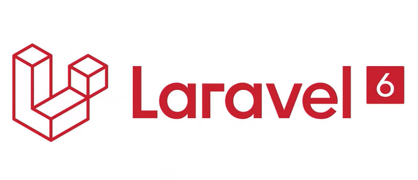

# Curso Laravel 

```shell
December 2019
Author: rhodfra@gmail.com
Laravel 6.* | PHP 7.4.0 (cli) | Composer version 1.9.1 | npm 6.12.1
```
<p align="center">
    
</p>

Laravel es uno de los frameworks para backend más famosos de los últimos años, aprenderlo es fundamental si se quiere incursionar en el desarrollo web ya que la mayoría de las empresas trabajan con él debido que es un framework que se caracteríza por ser fácil de usar, flexible y tiene una gran cantidad paquetes que nos ayudarán a increíbles sitios web.

En ésta primera entrega se pretende que se conozca lo básico del funcionamiento de dicho framework en su versión más actual a la fecha (Laravel 6, 2019).  A pesar de su importancia, en la primera fase de este curso no se tocan temas como *peticiones asincronas* o creación de SPA (Single page applications) con Vue.js, React.js o Angular.js.

Para conocer más acerca de los temas que abordará el curso ver [TEMARIO](TEMARIO.md)

## Conocimientos requeridos

* Manejo de paradigma orientado a objetos
* Conocimientos básicos de html, css y js
* Conocimientos básicos de php
* Conocimientos mínimos de base de datos

## Temario

<!-- Escribir el temario con links al md que trata el tema -->

## Handy commands

* En caso de que los cambios hechos en los archivos blade no se vean reflejados se deben limpiar los cache de laravel para lo cual se pueden utilizar los siguientes comandos.

  ```shell
  php artisan cache:clear # Limpiamos el cache de la aplicación
  php artisan route:clear # Limpiamos el cache de las rutas
  php artisan config:clear # Limpiamos el cache de las configuraciones
  php artisan view:clear # Limpiamos el cache de las vistas compiladas
  
  # En caso de estar en un shared-host se puede hacer lo siguiente si no se cuenta con ssh	
  Route::get('/clear-cache', function() {
      Artisan::call('cache:clear');
      return "Cache is cleared";
  });
  ```

* Para iniciar el servidor en otro puerto y la IP del nuestra computadora para que pueda ser visto en otras computadoras

  ```shell
  sudo php artisan serve --host 192.168.1.108 --port 8
  ```

## Resumen del curso

Este es un resumen del curso con los comandos y snippets más utilizados sin toda la teoría de por medio.

<!-- poner resumen --->

## Contributing 

La forma de contribuir se explica en [CONTRIBUTING](CONTRIBUTING).

## Licence 

Los términos generales del licenciamiento del proyecto se encuentran en [LICENCE](LICENSE) en caso de 
requerir mayor información, contactar con el autor.