[TOC]

## Instalación de laravel en MacOS

Para trabajar con laravel necesitamos tener instaladas las siguientes herramientas

* php
* composer
* npm y nodejs
* Y por supuesto, laravel

Además de lo anterior se necesita

* Un manejador de base de datos
* Y librerías de php necesarias para hacer la conexión con la base de datos

No es tan difícil como se lee y de hecho gracias a **brew** (un gestor de paquetes para mac) la instalación se hace muy rápido.

### Instalación de brew

En caso de que no tengamos brew debemos instalarlo para lo cual podemos hacer lo siguiente.

1. Nos dirigimos a la página oficial de brew para poder descargarlo, puede dar [aquí](https://brew.sh/index_es) para ir al enlace.

2. Ya en la página de brew nos darán una *instrucción* la cual debemos pegar en la terminal.

3. Abrir una terminal y pegar lo siguiente

   ```
   /usr/bin/ruby -e "$(curl -fsSL https://raw.githubusercontent.com/Homebrew/install/master/install)"
   ```

   La líne anterior fue sacada directamente de la página oficial.

Un vez que tengamos instalado brew podremos instalar php y composer de una manera muy sencilla.

**NOTA: Para instalar brew se necesita ser superusuario (también conocido como usuario administrador) de su computadora, si su computadora solo tiene un usuario entonces probablemente no tenga nada de que preocuparse.**

### Instalación de php y composer

Php y composer se instalarán con ayuda de brew para lo cual hacemos lo siguiente

```she
brew install php73
brew install composer
```

Para asegurarnos de tener la versión 7.3 de php podemos tirar en la terminal

```
php -v
```

Laravel no funcionará en versión de php inferiores a 7.2

### Instalación de laravel

Para instalar laravel lo haremos a través del gestor de paquetes de php llamado `composer`. A partir de aquí podemos seguir lo que dice la documentación de laravel sobre la instalación, para más información se puede consultar https://laravel.com/docs/6.x#installing-laravel.

Siempre que se haga uso de la documentación se debe revisar la versión de la misma. Por cada versión de laravel que sale hay un link hacia la documentación, para este curso estaremos usando la versión 6 de laravel. Para verificar lo anterior, existe selector en la parte superior derecha.

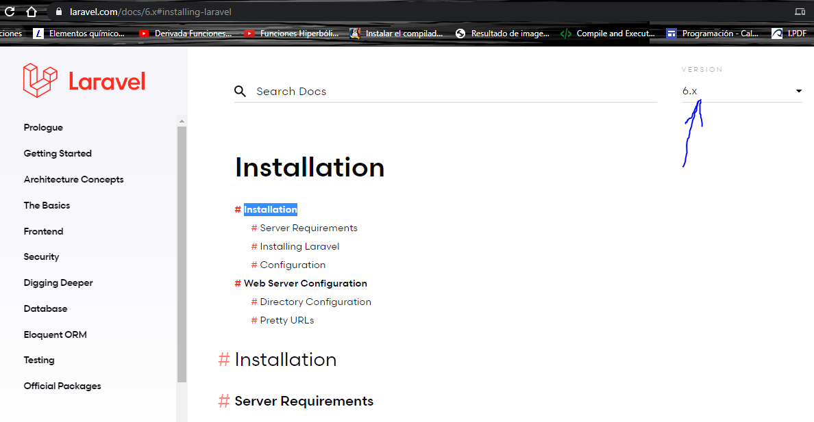

Para instalar laravel simplemente escribimos lo siguiente en la terminal

```
composer global require laravel/installer
```

Y la descarga de todos los paquetes iniciará

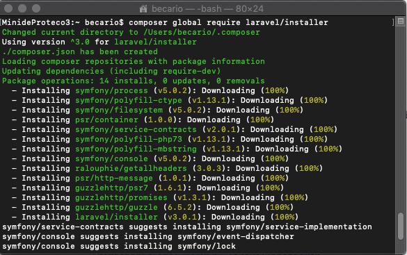

Hay dos formas en las que composer nos ayudará a descargar paquetes

* Los paquetes pueden ser solo a nivel de proyecto, solo se pueden usar los paquetes en el directorio que se haya invocado al comando composer.
* Los paquetes pueden ser globales es decir, se pueden hacer uso de dichos paquetes en el directorio que sea.

Nosotros instalamos laravel de manera global para poder utilizar el comando `laravel new` en la carpeta que sea, lo que hace ese comando es crear un proyecto de laravel, pero eso lo veremos con más calma en las siguientes secciones.

Si ahora tiramos en la terminal `laravel` nos dirá que no reconoce el comando, este problema se soluciona muy fácil.

1. Abrir una nueva terminal y escribir `nano ~/.bash_profile`
   * Dicho comando abrirá un archivo que posiblemente este en blanco
   * `nano` es un editor de archivos que se usa en la consola.
   * Si lo desea puede ocupar otro editor de textos, por ejemplo sublime, para ello tendría que buscar el archivo `.bash_profile` en el directorio que corresponde con su nombre de usuario.
   * El archivo .bash_profile es un archivo de configuración de su terminal, en el se pueden ejecutar los comandos que desea que se inicien cada que se abre una terminal y muchas cosas más.

2. Una vez que abrimos el archivo debemos escribir lo siguiente

   ```
   export PATH=$HOME/.composer/vendor/bin:$PATH
   ```

   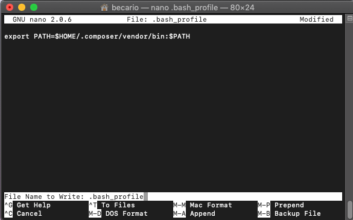

   * Para salir del nano, usamos la combinación de teclas `ctrl + x` , nos preguntará si deseamos guardar los cambios, para lo cual simplemente presionamos la tecla `y`, es decir, "yes"

     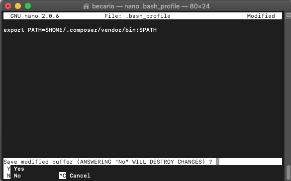

   * Ahora intente escribir `laravel` de nuevo en la terminal, posiblemente siga apareciendo un mensaje que diga que no se reconoce dicho comando.

     * Se puede hacer dos cosas, la primera es cerrar y abrir la terminal y el problema quedará resuelto. Otra cosa más elegante sería escribir lo siguiente

       ```
       source ~/.bash_profile
       ```

     * El comando source actualiza las configuración del archivo `.bash_profile`

   ¡Ahora ya todo debería funcionar con normalidad!

   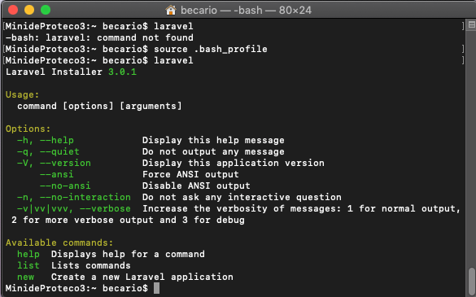

   **Felicidades has logrado instalar laravel existosamente!!!**

   Es buen momento para celebrar pero no para cantar victoria, falta algo, pero ya es mucho más sencillo.

### Instalación de NODEJS y NPM

Nodejs es toda una plataforma de desarrollo que nos permite crear software para distintas plataformas, principalemente web y desktop (aplicaciones de escritorio), como su nombre lo indica, funciona con js, es decir, javascript, un lenguaje que en los últimos años ha adquirido bastente popularidad por su versatilidad.

Por otra parte npm es un gestor de paquetes de node, *NPM* significa *node package manager*.

Laravel hace uso de npm ya que el framework funciona con paquetes de php y con paquetes de javascript, por ello es necesario instalarlo.

No se puede instalar npm sin nodejs, sin embargo esto no representa ningún problema ya que no ocupan mucho espacio en disco.

1. Para instalar estas herramientas basta con ir a su página oficial y descarga la opción que mejor nos convenga.

   * La página oficial de node es https://nodejs.org/es/

   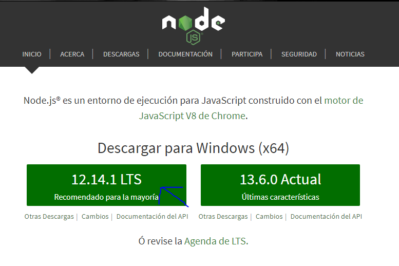

   * Al darle click a la versión recomendada descargará automáticamente un archivo con extensión .pkg, en ocasiones suele mandarnos a la siguiente vista

     

   Lo único que tenemos que hacer en este caso es darle click a la manzanita y comenzará a descarga el .pkg

2. Cuando el instalador se termine de descarga lo ejecutamos dando doble click en el y aparecerá lo siguiente

   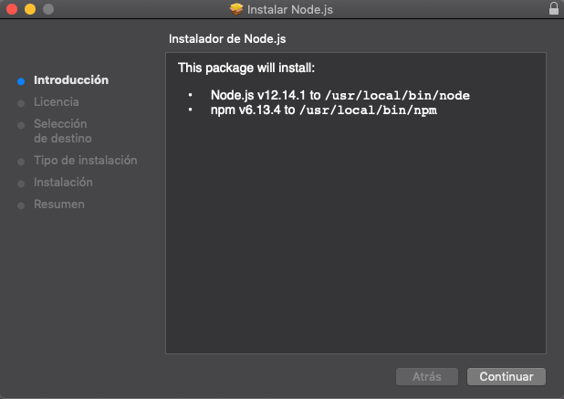

   * Ahora sigue hacer lo que me gusta llamar una instalación "estilo windows", es decir, damos siguiente, siguiente hasta que nos diga que todo salió bien.

A continuación se muestran las capturas de pantalla a medida que le damos siguiente

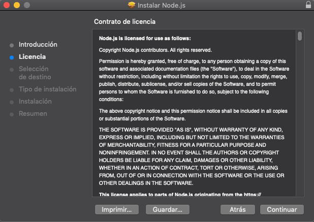

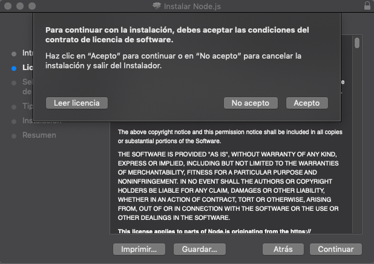

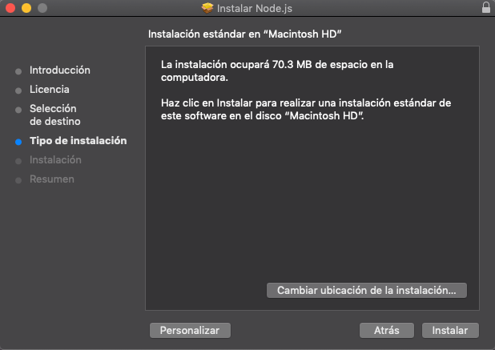

* Ahora debemos poner nuestras credenciales de administrador

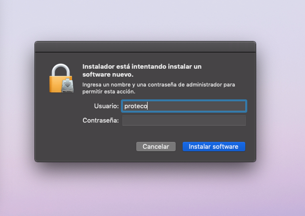

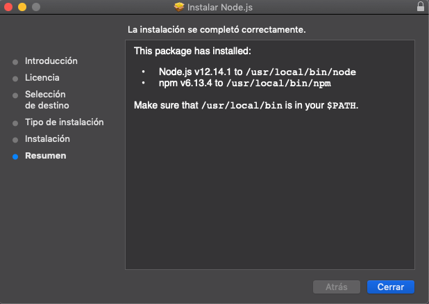

* No tiene ninguna importancia conservar el instalador por lo que se le puede mover a la papelera.

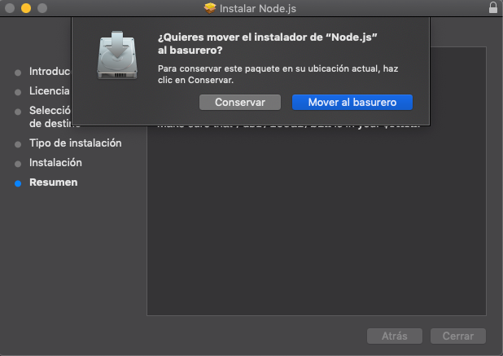

**Enhorabuena, ahora si podemos decir que tenemos laravel instalado**

### Comprobación de la instalación

Este último paso ya no es tan necesario pero es altamente recomendable que se realice para asegurarse al 100% que no hay errores.

Para comprobar la instalación podemos *crear un proyecto de laravel*, para lo cual haremos lo siguiente

1. Abrir una terminal y escribir lo siguiente

   ```
   laravel new prueba
   ```

   * Este comando crear un proyecto de laravel, para ello creará muchas carpetas y archivos que iremos viendo en el transcuros del curso.

   * Este proceso puede tardar de 2 a 5 minutos.

   * **Es necesario tener conexión a internet**

2. Una vez creado el proyecto debemos cambiarnos a la carpeta que tiene el mismo nombre el proyecto

   * Para ver que nuestro proyecto se haya creado podemos tirar el comando `ls`, dicho comando muestra los directorios y archivos qu tenemos en el directorio actual. 
     * Buscar la carpeta con el mismo nombre que el proyecto, es decir `prueba`
   * Ahora para cambiarnos a la carpeta escribimos `cd prueba`
     * cd es un comando que nos permite cambiarnos de directorio. En este caso nos permite cambiarnos al directorio prueba.

3. Finalmente escribimos `php artisan serve`, esto iniciará un servidor que nos permitirá ver el contenido web de nuestro sitio web.

   * Al escribir el comando anterior nos aparecerá una dirección como la siguiente

     ```
     127.0.0.1:8000
     ```

   * Debemos copiar dicha dirección en la barra de direcciones del navegador de nuestra preferencia.
   * Finalmente, veremos lo siguiente

   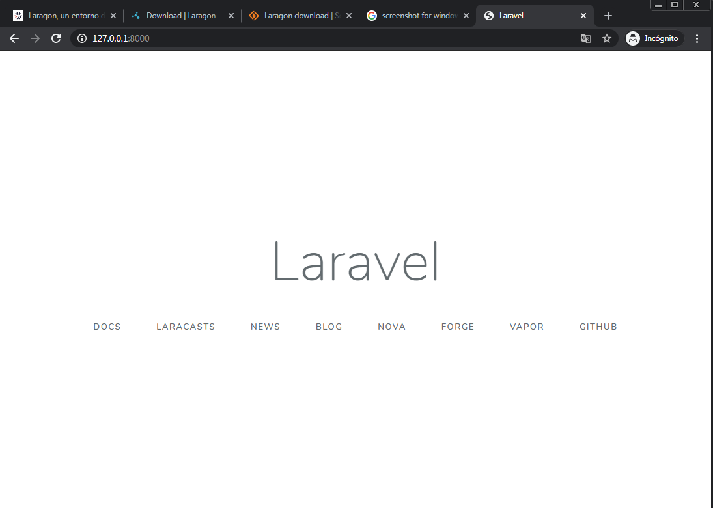

   **NOTA: Para detener el servidor presionamos ctrl + c**