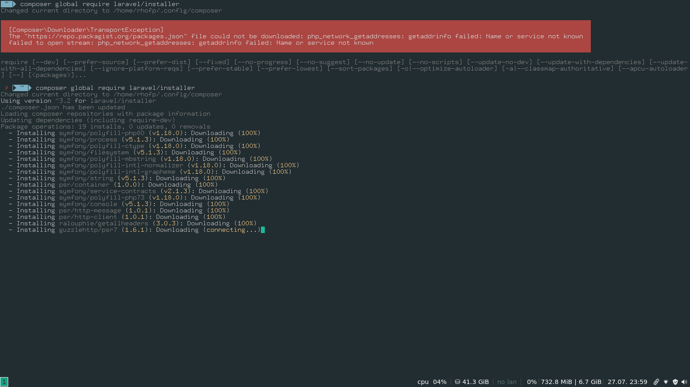
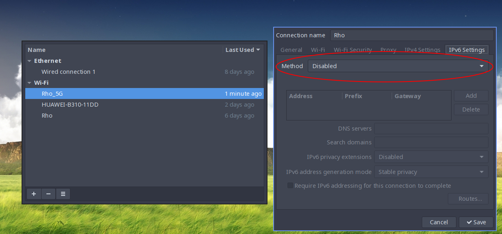

# Curso laravel

## Instalación y configuración del entorno de trabajo en sistemas Unix

Para utilizar Laravel en sistemas operativos basado en Unix como es el caso de GNU/Linux y MacOS se recomienda

* Para el caso de GNU/Linux tener experiencia instalando paquetes con el el gestor de paquetes o de manera manual
* Haber configurado antes variables de entorno

Cabe mencionar para el caso de windows existe *Laragon* en el cual no sé tienen que configurar muchas cosas para poder utilizar laravel.

Para trabajar con laravel tenemos tener lo siguiente

* php  > 7.0
* composer
* nodejs y npm
* laravel/installer

### Para ArchLinux

Considero que hacer la instalación el una distribución de linux basada en archLinux es la manera más fácil de tener el ambiente configurado. Además, al ser *rolling realise*  nos asegura que siempre tendremos la última versión de los paquetes sin siquiera tener que pedirselo. Obviamente existen sus pros y contras de esto último.

- Instalación de php

  ```shell
  sudo pacman -S php
  ```
  
  Dependiendo de la BD con la que vayamos a trabajar a veces es necesario editar el archivo `/etc/php/php.ini` , para el caso de *MYSQL* esto no es necesario

  Nota: Los comentarios en el archivo `php.ini` se crean con `;`

- Instalación de composer

  ```shell
  php composer install
  ```

- Instalación de Node y npm

  ```shell
  sudo pacman -S npm
  ```

### Para distribuciones basadas en debian (Ubuntu y todos aquellos que utilicen apt)

* Instalación de php

* Antes se debe configurar el repositorio en el sistema

  ```sh
  sudo apt install software-properties-common
  sudo add-apt-repository ppa:ondrej/php
  
  sudo apt udate # Actualiza la lista de paquetes con base en la info de los repositorios
  
  ```

  ```sh
  sudo apt install -y php7.4
  sudo apt install php7.4-mysql php7.4-curl php7.4-json php7.4-cgi php7.4-xsl curl php7.4-cli php7.4-mbstring unzip #Modulos básicos de php requeridos
  ```

  **Nota: En caso de que el segundo falle intentar quitan el 7.4 después de php**

* Ahora para instalar composer podemos seguir las instrucciones de la página oficinal (esto podría aplicar también para MacOS, aunque daremos otra solución)

  * El sitio oficial de composer  es https://getcomposer.org/download/

  ```sh
  php -r "copy('https://getcomposer.org/installer', 'composer-setup.php');"
  php -r "if (hash_file('sha384', 'composer-setup.php') === '8a6138e2a05a8c28539c9f0fb361159823655d7ad2deecb371b04a83966c61223adc522b0189079e3e9e277cd72b8897') { echo 'Installer verified'; } else { echo 'Installer corrupt'; unlink('composer-setup.php'); } echo PHP_EOL;"
  php composer-setup.php
  php -r "unlink('composer-setup.php');"
  ```

### Para MacOS

Se asume que se tiene instalado brew porque es muy práctico y es el gestor de paquetes de MacOS por defecto, en caso de no tenerlo instalado, [click aquí](https://brew.sh/)

* Para instalar php

  * De hecho suele venir instalado en la mayoría de los casos

  ```sh
  brew install php
  ```

* Para instalar composer 

  ```sh
  brew install composer
  ```

### Pasos comunes

Para los cualquier sistema basado en Unix la siguiente configuración es muy similar si se utilizar *bash* como SHELL

De manera opcional, pero altamente recomendable, instalar el instalador de laravel, para ello basta con seguir las instrucciones de la documentación.

```shell
composer global require laravel/installer
```

Para el caso de GNU/Linux y macOS se debe modificar la variable de entorno `$PATH`, al modificarla logramos que el comando `laravel` se pueda ejecutar en cualquier ruta en la consola.

La variable `$PATH` puede ser modificada en el archivo `~/.bashrc`  o en el archivo `.profile` (es al gusto del cliente) por lo cual  solo basta abrir el archivo con el editor de preferencia, en este caso se escogió `nano`

```shell
nano ~/.bashrc
```

Hasta el final del todo el contenido del archivo `bashrc` agregaremos lo siguiente.

```shell
export PATH="~/.config/composer/vendor/bin:$PATH"
```

**Consideraciones:** La configuración de la variable de entorno `$PATH` se hace asumiendo que su shell por defecto es `bash` en caso de tener otra shell en resumidas cuentas lo que se debe hacer es:

- Encontrar el archivo de configuración del su shell
- Halla la manera de exportar correctamente la variable de entorno `$PATH`

Por último, ejercutar el siguiente comando

```shell
source ~/.bashrc
```

El cual cargará los nuevos cambios a la shell.

Para verificar que todo este funcionando basta con tirar el comando `laravel` en la consola.

## Instalación de una BD

Para trabajar con laravel necesitamos un servidor http y un manejador de base de datos

* Por el servidor http no debemos preocuparnos ya que php tiene un servidor de pruebas (que laravel utiliza con una capa de abstracción) que nos servirá para todo el curso. En un proyecto en producción se puede considerar Apache o NGNX, por mencionar algunos
* Laravel es compatible con muchos manejadores de base de datos:
  * MySQL 5.6+ ([Version Policy](https://en.wikipedia.org/wiki/MySQL#Release_history))
  * PostgreSQL 9.4+ ([Version Policy](https://www.postgresql.org/support/versioning/))
  * SQLite 3.8.8+
  * SQL Server 2017+ ([Version Policy](https://support.microsoft.com/en-us/lifecycle/search))
* En nuestro caso utilizaremos MySQL por simplicidad.

Para no preocuparnos por las configuraciones de una BD y todo lo que implica instalar una, se utilizará XAMPP. La instalación es realmente sencilla y en todos los casos la instalación se basa en el clásico "siguiente, siguiente, finalizar".

Para cualquier caso, descargar el correspondiente instalador en la siguiente página: https://www.apachefriends.org/es/index.html

* Para ejecutar el instalador en linux debemos abrir una terminal en el directorio donde descargamos el instaldor y ejecutar el instalador utilizando `sudo` de la siguiente manera:

  ``` sh
  sudo ./xampp-linux-x64-7.4.8-0-installer.run
  ```

  Esto nos abrirá una ventana en donde prácticamente podemos dar "siguiente", tantas veces como sea necesario, hasta llegar al opción de finalizar.

Para el caso de MacOS, se descarga el instalador correspondiente y se ejecuta y cómo es costumbre, nos pedirá copiar el programa a "Applications" o pedirá confirmación para copiarlo con un doble click.

## Creación de un proyecto de prueba

Para crear un proyecto en laravel se ejecuta el siguiente comando

```sh
laravel new proyecto-nuevo
```

Asegurese de que no haya ningún error. De no haber error hemos concluido con la configuración básica.

### Extraño bug detectado

Al querer iniciar un nuevo proyecto de laravel con el comando que se muestra arriba me arrojo el siguiente error



Dicho error se debe a que los repositorio de composer no permiten peticiones de computadores con `ipv6`, por lo cuál se tuvo que desactivar `ipv6` de la interfaz para conectarse a internet, en este caso del wifi. Para ello nos dirigimos al *applet* para editar conexiones y nos vamos a la pestaña de configuraciones de ipv6



Finalmente en la opción de método, seleccionamos "desactivar" y reinciamos el servicio de internet de nuestra computadora, esto se puede realizar con ayudar de `systemd` o saliendo y entrado de sesión.