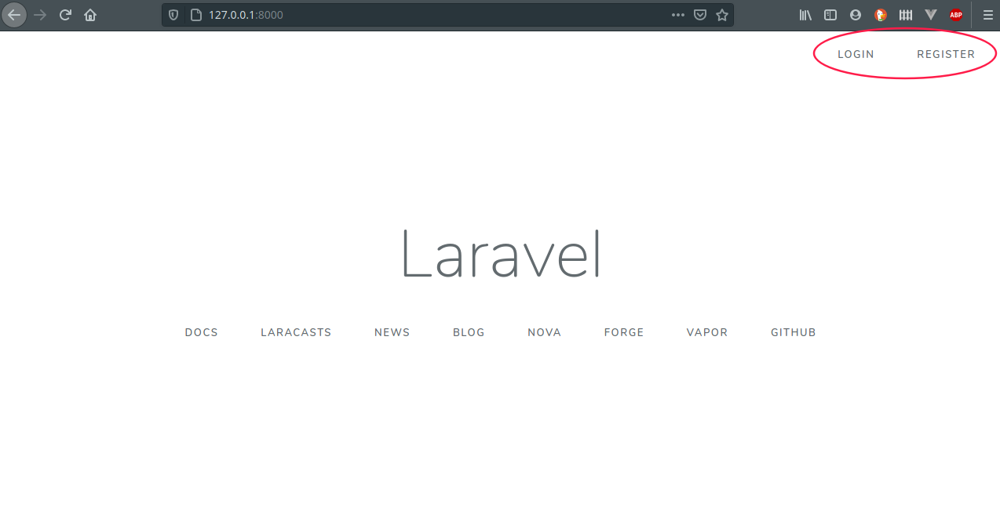
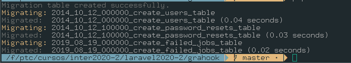
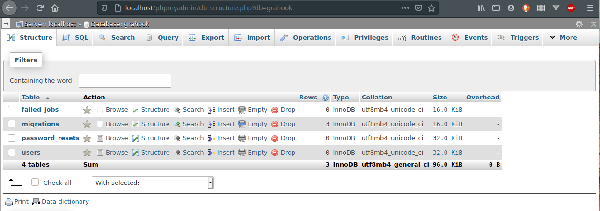
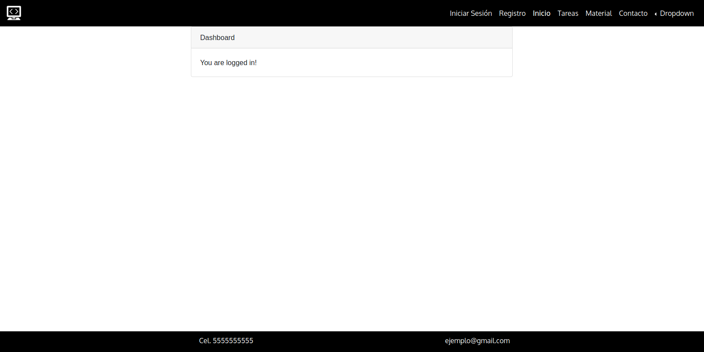

# Creación de grahook(sitio web) día 01

## Objetivos

* Configurar el sistema de autentificación que `laravel/ui` provee.
* Explicar los directorios más importantes de laravel

**Observaciones**

* La instalalación de los paquetes necesarios para la autentificación se pueden dejar descargando y continuar con la explicación.

<!-- TODO:- Agregar capturas de pantalla o GIFs de lo que se obtendrá en esta sección -->

Para crear un nuevo proyecto 

```sh
laravel new grahook
```

*Recuerda cambiarte al directorio del proyecto que acabas de crear*

## Configuración de la auntentificación en Laravel (Parte 01)

El objetivo de un framework es proporcionarnos herramientas para tengamos listo todo y que solo nos concentremos en desarrollar nuestras ideas.

Lo primero que configuraremos será la autentificación de usuarios (login y registro). Para lo cual nos basamos en la [documentación oficial de laravel](https://laravel.com/docs/7.x/authentication), para implementar dicho módulo debemos hacer lo siguiente: 

```sh
composer require laravel/ui # Tarda un poco
php artisan ui vue --auth
npm install # Instala las nuevas dependencias de JS
npm run dev # Compila las dependencias de JS
```

<!--TODO:- Explicar que es artisan -->

Para ejecutar un servidor de pruebas en GNU/Linux y MacOS podemos ejecutar el siguiente comando.

```sh
php artisan serve
```

En el caso de laragon

<!-- TODO:- Agregar cómo se haría en laragon -->

**Si todo ha ido bien deberíamos ver dos botones en la derecha del *navbar* **



Al probar el registro o el login más probable es que tengamos el siguiente error o uno parecido

* *unknown database*

**Continua en la parte 02, en esta misma sección**

## Directorios y archivos importantes

### Directorios

* app. Se encuentran otras carpetas muy importantes como:
  * Controller, Middleware y los archivos que representan los modelos de la BD
* config. Archivos de configuración del proyecto
* database. Archivos de migraciones que representan los cambios a nuestra BD.
* public. Aquí se encuentran todos los archivos que puede ver cualquiera con acceso al servidor.
* resources: 
* routes

### Archivos

* .env

## Configuración de la auntentificación en Laravel (Parte 02)

Antes de poder utilizar el módulo de autentificación debemos tener configurada nuestra base de datos, este caso utilizaremos `MySQL`. 

**En el caso de Laragon solo debemos hacer lo siguiente:** 

<!-- TODO:- Completar con pantallazos -->

**En GNU/Linux:**

Para poder conectarse a MySQL primero es necesario que el daemon o servicio este encedido. Si contamos con la instalación de *lampp*, la cual se recomienda por ser muy sencilla de instalar y además viene con phpmyadmin y otras herramientas muy útiles, debemos hacer lo siguiente

```sh
sudo /opt/lampp/lampp start
```

En este caso se considera que lampp se instaló en el directorio `/opt`, puede que los hayas instalado en un directorio distinto.

Al iniciar lampp se inician MySQL y Apache, por lo que solo resta entrar a  `phpmyadmin` desde el navegador y comenzar a configurar un BD, para ello, desde el navegador ingresamos a `http://localhost/phpmyadmin/`

Por otra parte, es necesario asegurarse que el lenguaje `php` tenga habilitada la biblioteca para trabajar con MySQL. Debemos abrir el archivo `/etc/php/php.ini` y buscar que las siguientes líneas no esten comentadas.

```php
extension=mysqli
extension=pdo_mysql
```

Se recomienda reiniciar la computadora para asegurarse que los cambios tomen efecto.

**En MacOS:**

<!-- TODO:- Completar con comandos -->

Una vez hecho lo anterior, debemos configurar el archivo `.env` de nuestro proyecto (para el caso de laragon puede que no necesitemos hacer nada). Se deben cambiar las siguiente variables de acuerdo a nuestra información

```sh
DB_DATABASE=grahook
DB_USERNAME=root
DB_PASSWORD=
```

* `DB_DATABASE`  es el nombre de la BD.
* `BD_USERNAME` es el nombre de usuario propietario de la BD
* `BD_PASSWORD` es la contraseña del usuario

**Ojo: El archivo .env contiene información importante por lo que no se debe compatir**

Con esto tenemos acceso a nuestra base de datos, sin embargo, esta vacía, no tiene tablas, ni mucho menos datos, por lo que debemos hacer una *migración* (dicho concepto se profundizará en secciones posteriores):

``` sh
php artisan migrate
```

Nota: Siempre que se configuré el archivo `.env` se debe reiniciar el servidor.

Al ejecutar la migración en la terminal debemos ver lo siguiente:



Y el `phpmyadmin` debemos ver:



Adicional a `phpmyadmin` podemos consultar los datos que tenemos en nuestra base de datos por medio de una herramienta que proporciona Laravel.

Ejecutamos lo siguiente

```php
php artisan tinker
```

Se nos desplegará una consola similar a las de `python`, en ella podemos tirar código de php que queramos probar y a veces se suele usar para hacer pequeñas consultas, por ejemplo:


<!-- ---- LO QUE SIGUE SERÁ EN FORMATO VIDEO ------ -->

## Rutas y controladores (básico)

Vamos a analizar nuestras rutas :) 

Abrimos nuestro archivo web.php (ruta: `routes/web.php`)

``` php
<?php

use Illuminate\Support\Facades\Route;

/*
|--------------------------------------------------------------------------
| Web Routes
|--------------------------------------------------------------------------
|
| Here is where you can register web routes for your application. These
| routes are loaded by the RouteServiceProvider within a group which
| contains the "web" middleware group. Now create something great!
|
*/

Route::get('/', function () {
    return view('welcome');
});

Auth::routes();

Route::get('/home', 'HomeController@index')->name('home');
```

Laravel crea por defecto la página principal que regresa la vista "Welcome". Ahora vamos a ver como funciona.

Lo que está entre comillas (el primer parámetro) es la ruta y el segundo es lo que se hará en respuesta a la petición, aquí estamos ejecutando una función que regresa una vista.

Podemos regresar todo tipo de cosas, por ejemplo
Vamos a copiar y pegar la primera ruta y cambiamos el nombre

```php
Route::get('suma', function () {
    return 5+98;
});
```

Podemos pasar también cadenas de texto

``` php
Route::get('saludo', function () {
    return 'Hola, buenos tardesss';
});
```

Y pasar parámetros

```php
Route::get('bienvenido/{id}', function ($id) {
    return 'Hola, buenos tardesss '.$id;
});
```


Esto es útil cuando tenemos un sistema con muchos usuarios, la diferencia sería que en lugar de nosotros pasar manualmente el Id, el sistema tendría que reconocerlo.

O parámetros opcionales

```php
Route::get('saludo/{name?}', function ($name=null) {
    return 'Hola, buenos tardesss '.$name;
});
```

Esto nos va  a ser muy útil después entonces grábenselo bien.

Todo esto lo podemos hacer dentro de este archivo, pero estas cosas muy simples y conforme avancemos nuestro web.php se haría muy largo y nada práctico. Entonces Laravel nos da la opción de usar controladores, que como su nombre lo dice, controlan lo que devolveremos en una ruta determinada. Vamos  a probar…

```php
Route::get('hola', 'HolaController@index');
```

Para crear un controlador lo haremos desde la terminal con el comando

```sh
php artisan make:controller HolaController
```

Y para ver todas las posibles opciones de utilizamos la bandera `-h`

```sh
php artisan make:controller -h
```

Regresando a nuestro proyecto, la vista welcome no la voy a usar entonces la **eliminamos** y vista
`welcome.blade.php`

<!-- TODO:-Explicar que es un middleware -->

Analizando HomeController vemos que tiene un Middleware, y lo que yo quiero es que unicamente usuarios autenticados puedan tener acceso al contenido.

Nos quedamos unicamente con:

```php
Auth::routes();
Route::get('/', 'HomeController@index');
```

Ahora, para que después del login y register nos mande a la ruta correcta tenemos que corregir algunas cosas:
Vamos a `app/Http/Controller/Auth` y reemplazamos 

```php
protected $redirectTo = '/';
```

Debemos hacerlo en todos los archivos.

## Integrando plantilla (layouts)

El paso siguiente es integrar nuestras propias vistas. Para esto van a ir a la carpeta de recursos y copiarán el `css`, `js` e `img` dentro de su carpeta `public` en su proyecto

Vamos a analizar las vistas que tenemos hasta ahorita, dentro de `layouts/app` tenemos unicamente la navbar
Y dentro de home tenemos el contenido pero sin la navbar, esto es porque blade nos permite heredar elementos de otras vistas.

Abrimos:
`app.blade.php`
Copiamos nuestro código de
`app.html` 

Dentro de la etiqueta main ponemos `@yield(‘content’)` 

Vemos que en `home.blade.php` tenemos un extends `layouts.app` y después declaramos una nueva sección que se llama content, la cual vamos a insertar en `app.blade.php` 

¡Y probamos!

## Personalizamos app.blade.php

Pegamos 

```php
<html lang="{{ str_replace('_', '-', app()->getLocale()) }}">
<meta name="csrf-token" content="{{ csrf_token() }}">
<title>{{ config('app.name', 'Clase1') }}</title>
```

Modificamos los src con 

```php
<link rel="stylesheet" href="{{asset('css/styles.css')}}">
```


La función `asset` nos ubica directamente en la carpeta public y de ahí empezamos a buscar la ruta, entonces haremos eso con todos los href, con los scripts de abajo y con la imagen de la *Navbar*

Vamos a la documentacion Blade Templates>Auth Directives y tenemos la opción de poner una condición dependiendo de si el usuario está autenticado o no, entonces, cuando el usuario sea un guest, es decir no está logeado, unicamente tendrá la opción de iniciar sesión o registrarse, una vez adentro le aparecerán las demás opciones
entonces pondremos un 

```php
@guest, @else, @endguest
```

Ahora pondremos las rutas correctamente,
Para la imagen tenemos la opcion de poner 

```php
href="{{ url('/') }}"
```

Tenemos la opción de usar route, con url tenemos que pasarle la url completa y con route únicamente el nombre de la ruta, es más conveniente.
Ponemos rutas

```php
href="{{ url('/') }}" 
href="{{ route('login') }}"
href="{{ route('register') }}"
```

Y copiamos el Logout
El logout tiene algo de complejidad pero ya está hecho entonces vamos a copiar y pegar completo.

```php
<a 
    class="dropdown-item" 
    href="{{ route('logout') }}"                    
    onclick="event.preventDefault();document.getElementById('logout-form').submit();"> 
    Cerrar sesión
</a>
<form id="logout-form" action="{{ route('logout') }}" method="POST" style="display: none;">
	@csrf
</form>

```


Todas las variables en blade van dentro de llaves.

Probamos logout y debería funcionar.

## Resultado final

