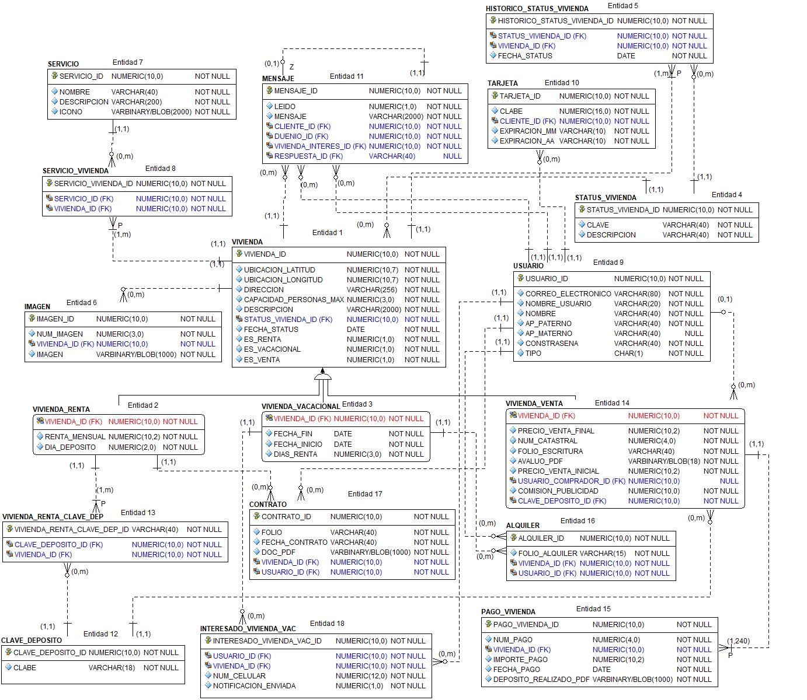
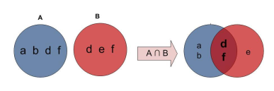

# Curso laravel

[TOC]

Problamente esta es la sección del curso con mayor *complejidad*, dicha complejidad no reside en el uso de las herramientas para manipular los objetos de una base de datos sino en tener ciertos conocimientos de base de datos. De antemano si cuenta los conocimientos básicos de diseño de base de datos y SQL, puede saltarse la siguiente sección.

Laravel, así como muchos frameworks relacionados con el desarollo de sitios web utilizan un ORM para comunicarse con la base de datos, dicho ORM permite que la implementación del *modelo* (creación de entidades, constraints, llaves primarias, consulta y filtrado de datos y un largo etcétera) sea independiente del manejador de base de datos que estemos ocupando. A pesar de ello se deben tener los conocimientos mínimos del manejador que se vaya a ocupar para poder configurar la conexión y solucionar conflictos de una manera más diestra.

## Base de datos 

Empecemos intentanto sintetizar un curso completo de base de datos en algunas decenas de parráfos.

Una base de datos es ...

Por otra parte un DBMS es ...

Existen diversos tipos de base de datos ( y diversas formas de clasificar las BD), por ejemplo:  BD relacionales, BD XML, BD noSQL, etc.

Así mismo existen muchas formas de modelar los datos que en su mayoría corresponden con el tipo de base de datos en el que se vaya a implementar dicho modelo.

Los modelos más populares para representar datos son 

* El modelo entidad-relación (Diseño conceptual)
  * Para sus representación se utiliza el **formato Chen**
* El modelo relacional (Diseño lógico)
  * Para su representación se suele utilizar el **formato Crow's foot** o **formato IE** o **formato de Martin**
  * Una notación que también se suele utilizar es **IDE1X**.

Las bases de datos vistas en un esquema son:


Por suerte, a nosotros solo nos interesa **aprender el modelo relacional** poder pasarlo a modelos de *laravel*.



No veremos ejemplos tan complicados como el anterior, pero nos da una idea de lo que podremos enfrentarnos en un futuro.

### Modelo relacional

#### Entidades y atributos

**Las entidades** se representan por medio de **tablas**, las cuales son las unidades de almacenamiento primario. 

* Su nombre debe ser único. 
* El nombre de la entidad generalmente es un *sustantivo*.
* Se recomienda escribir su nombre en singular. 
* Los datos de una **columna** deber ser del mismo tipo. Cada columna representa un **atributo**  o **campo** de la entidad.
* Cada tabla debe contar con uno o más atributos para identificar de manera única a sus registros de manera única, llamada **llave primaria**.

Una **instancia** será equivalente a decir 1 **registro** de una tabla (**renglón**).

**Consideraciones**

* Una entidad deben contar con al menos 2 atributos
* Si un atributos se puede descomponer en sub atributos entonces este podría llevar a transformase en una entidad, depende de las *reglas de negocio*.

**Consideraciones muy particulares o poco frencuentes**

* Una entidad puede contar con un atributo, aunque no suele suceder.

<!-- Aquí van los ejemplos -->

##### Atributos obligatorios, opcionales y derivados

<!-- Falta completar aquí -->

#### Restricciones (Constraints)

El modelo relacional define las siguiente restricciones

| Tipo de restricciones           | Implementación          |
| ------------------------------- | ----------------------- |
| Restricciones de llave primaria | Primary key             |
| Restricciones de referencia     | Foreign key             |
| Restricciones de integridad     | Check, not null, unique |
| Validación por trigger          | Trigger                 |

*Únicamente las 2 primeras restricciones se ve de manera gráfica en el **diseño lógico**, las otras dos se implementan en el RDBMS.*

##### Restricciones de llave primaria

La llave primaria (PK) es una columna o conjunto de columnas cuyos valores identifican de manera única a cada registro de la tabla.

**Consideraciones obligatorias**

* Los valores de la PK no deben duplicarse
  * Para ello el RDBMS implementa n indice de tipo unique
* Los valores no pueden ser nulos
  * Para ello el RDBMS implementa una restricción *not null*
* Los valores de la PK no debe modificarse una vez asignados.
* Si una un registro de la tabla se borra su correspondiente valor no podrá volver a ser usado.

**Consideraciones opcionales**

* En cuanto a desempeño, una los valores de una PK deben ser *númericos, enteros y consecutivos*.

Existen varios tipos de llaves primarias, lo cierto es que en este curso solo utilizaremos llaves primarias artificiales por desempeño y por así viene configurado laravel

* **LLaves primarias artificiales**: Secuencia de valores enteros iniciando en 1 conocidos como id's de. Son atributos que no tienen significado para las reglas negocio.
* **Llaves primarias naturales**: Atributo que cuenta con las características para ser una PK y tiene signifcado para las reglas de negocio.
* **Llaves primarias cantidatas**: Atributo que cumple con la definición de PK pero que por algún motivo no fue seleccionada.
* **Llaves primarias compuestas**: Llave primaria formada por dos o más atributos
  * La unicidad de los valores depende de la combinación de los valores de cada atributo.

<!-- Ahora sí a poner ejemplos -->

##### Restricciones de referencia

Las restricciones de referencia se emplean para relacionar tablas, el RDBMS las representa por medio de llaves foráneas (FK).

Sean 2 entidades A y B en donde B puede ser igual a A.

*La FK es un atributo de una tabla B cuyos valors hacen referencia a los valores de la PK de una tabla A.*

Tipicamente a la tabla A se le conoce como tabla "PADRE" y a la  tabla B como "HIJA".

<!-- Ejemplos -->

#### Representación de relaciones

En todos los diseños de BD las entidades se relacionan entre ellas, de ahí el nombre de *modelo relacional*. Para identificar la manera en que se relacional se necesita conocer su tipo.

* Uno a uno **1:1** ó 1..1
* Uno a muchos **1:m** ó 1..*
* Muchos a muchos **m:n** ó * .. *

##### ¿Cómo detectar el tipo de relación?

Sean 2 entidades A y B, para cada una de ellas se deben analizar lo siguiente

**¿Cuántas instancias de A se relacionan con una de B?**

y la viceversa, **¿Cuántas instancias de B se relacionan con una de A?**

Las combinaciones de las respuestas pueden ser las siguientes


##### Ejemplos

<!-- Ver apuntes, tema 2 página 4 -->

##### Niveles de dependencia

Los niveles de dependencia indican que tan "fuerte" es la relación entre dos entidades.

###### Relaciones no identificativa

La relaciones no identificativas o suaves o débiles se emplean para representar principalmente relaciones 1:M aunque en algunos casos, se emeplean relaciones 1:1 y M:N.

* Se representan con una línea punteada.
* La PK de la tabla padre pasa como FK *únicamente*, en la tabla hija.

<!-- Ejemplos -->

###### Relaciones identificativa

Las relaciones identificativas o duras o fuertes se emplean para representar relaciones 1:1 principalmente.

* Se representan con una línea continua.
* La PK de la tabla padre pasará como PK y FK de la hija

##### Cardinalidad

La cardinalidad expresa el número mínimo y máximo de instancias asociadas con una instancia de otra entidad.

Se emplea el formato (x,y) en donde

* x = valor mínimo
* y = valor máximo (Si el valor no se conoce se escrbir ""*'' ).

Las posibles combinaciones se puede apreciar al observar la notación **crow's foot**. 


##### Relaciones unarias o recursivas

Las relaciones recursivas ocurren al relacionar *n* instancias de una entidad con una instancia de la misma entidad.

<!-- Ejemplos -->

##### Relaciones ternarias

En realidad son las relaciones muchos a muchos, lo único importante es que se emplea una tabla *intermedia* para poderse representar en el diseño lógico, dicha tabla intermedia puede

* Tener atributos, los cuales no forman parte de la entidad A ni de la entidad B sino de la relación.
* La tabla intermedia puede relacionarse con otras tablas a lo cual se le conoce como *agregación*.

#### Índices

Los indices de base de datos son similares a los índices de un libro, su objetivo es reparar un dato de la forma más rápida y eficiente posible.

Se suele indexar las columnas que se consulten de manera frecuente, por ejemplo: email, nombre, núm de cuenta, folio, etc.

¡Cuidado! a mayor número de índices puede existir problemas de desempeño en oparaciones DML (inserción, eliminación o actualización de datos).

### SQL

SQL Structured Query Language, actualmente Database Language Query, es un lenguaje de base de
datos empleado para:

* Creación y manipulación de las estructuras de una base de datos.
* Administración de los datos
* Ejecución de sentencias complejas diseñadas para transformar los datos almacenados en información útil.

#### Categorías de SQL

| Lenguaje                         | Definición                                                   | Clausulas básicas                                            |
| -------------------------------- | ------------------------------------------------------------ | ------------------------------------------------------------ |
| DDL (Data Definition Language)   | Lenguaje de definición de datos. Es el lenguaje encargado de la creación, modificación y eliminación de la estructura de los objetos de la base de datos (tablas, índices, vistas, etc) | create<br/>alter<br/>drop<br/>rename<br/>truncate<br/>comment |
| DML (Data Manipulation Language) | Lenguaje de manipulación de datos. Es el lenguaje que permite realizar las tareas de consulta, modificación y eliminación de los datos almacenados en una base de datos. | insert<br/>update<br/>delete<br/>merge                       |
| DCL (Data Control Languaje)      | Lenguaje de control de datos. Es el lenguaje encargado de configurar y establecer el control de acceso a la base de datos. Incluye instrucciones para definir accesos y privilegios a los distintos objetos de la base de datos. | grant<br/>revoke                                             |
| DQL (Data Query Language)        | Lenguaje de consulta de datos. Algunos autores clasifican a la instrucción SELECT como el único elemento de una cuarta categoría del lenguaje SQL Data Query Language (DQL). | select                                                       |
| Transaction control              | Control de transacciones. Es el lenguaje empleado para crear, y administrar transacciones aplicadas a un conjunto de sentencias DML principalmente. | commit<br/>rollback<br/>savepoint                            |

En este curso no aprenderemos SQL aunque si tendremos un ligero acercamiento al DQL ya que sin él no se podrían entender las instrucciones de laravel para recuperar la información de la base de datos. 

Saber DQL nos ayudará a realizar consultas de forma óptima y también nos ayudará entender los errores que el framework arroje.

#### Tipos de datos

#### DQL (Data Query Language)

La instrucción select es la única del DQL y sirve para obtener datos almacenados por el RDMS.

La sintaxis de la instrucción es sencilla, sin embargo, rara vez se emplea su forma simple.
Generalmente una consulta requiere hacer uso de condiciones, joins, agrupación de datos, etc.

##### Sintaxis SQL estándar

```sql
select [distinct]
{
    [<qualifier>.]<column-name>| * |<expression>
    | <pseudocolumn> as <column-alias>
    },...
from
{
	<table-or-view-name> | <inline-view> | [[as] <table-alias>]
}
[where <predicate>]
[group by [<qualifier>.]<column-name>,...
	[having <predicate>]
]
[order by {<column-name>|<column-number>}
	[asc|desc]
];
```

##### Ejemplos básicos

<!-- Aqui falta -->

##### Alias en columnas

Un alias de columna permite proporcionar una forma distinta de nombrar a una columna únicamente para ser presentada como parte de la respuesta de la instrucción SELECT.

##### Alias en tablas

De manera similar, los alias a nivel de tabla se emplean para nombrar o señalar a una tabla empleando
algún otro nombre.
Los alias de tablas se emplean principalmente para las sentencias select que requieren hacer uso de joins con otras tablas (se revisa más adelante este tema). En este caso normalmente las tablas se representan con unos cuantos caracteres para evitar escribir el nombre completo de la tabla.

##### Sub-consultas

<!-- falta -->

##### Operadores del álgebra relacional

El álgebra relacional es un lenguaje formal integrado principalmente por una serie de operadores unarios y binarios que se aplican sobre una o varias relaciones. 

El álgebra relacional define la manera desde un punto de vista teórico la forma de realizar la manipulación de los datos del contenido de una tabla

###### Union

La unión de 2 relaciones o conjuntos A y B es un nuevo conjunto que contiene todos los elementos de A y de B. En donde los duplicados se excluyen. 

Para realizar la unión, las columnas de ambas tablas deben ser compatibles en cuanto a número de columnas, y deben ser del mismo tipo de dato.


###### Interseccion

La intersección de 2 conjuntos A y B es el resultado de obtener todos los elementos comunes a A y B.




###### Diferencia

La diferencia de 2 conjuntos A y B se define como el conjunto A-B que consiste de todos los elementos
de A que no existen en B.

* $A-B \neq B - A$


###### Producto

El producto, o llamado también producto cartesiano formado por A X B de 2 conjuntos A y B, es un nuevo conjunto integrado por parejas de elementos {x,y}, donde x es un elemento de A, y y es un elemento de B.


##### Operador Join

El operador Join realiza una unión de 2 relaciones aplicando un predicado p para asociar las tuplas de R con las tuplas de S.

Para realizar la liga o asociación de tablas, siempre se realiza igualando los valores de los campos que tengan en común.

Los joins se pueden clasificar de la siguiente forma.

* Inner join
  * Equi join
  * No equi join
  * Natural join
* Outer join
  * Left outer join
  * Right outer join
* Cross join: Es equivalente al producto del álgebra relacional.
* Self join: Como su nombre lo indica, es un join consigo mismo, se presenta en relaciones recursivas.

Para efectos del curso solo nos concentraremos en los siguiente joins.

* Equi join al cual simplemente nos referiremos a él como inner join o cómo join
* Left outer join al cual haremos referencia como left join
* Right outer join al cual haremos referencia como right join

La principal diferencia de los Inner joins con los outer joins es que los inner joins únicamente incluyen en la salida de la consulta los registros que tengan correspondencia con la tabla asociada.

En el caso de un outer join es posible mostrar los registros faltantes, aunque no tengan una correspondencia con la tabla asociada. 

Por ejemplo, suponga que se desea mostrar el reporte de todos los clientes, aunque estos no cuenten con una tarjeta de crédito.


##### Inner join

##### Outer join

Las sentencias `left` y `right` reflejan el orden en el cual las tablas son procesadas por el manejador.
La primera tabla es la que se especifica en la cláusula from corresponde con el “lado izquierdo”, y la segunda tabla corresponde al “lado derecho”.

El siguinete caso puede aclarar las diferencias.

Un estudiante puede o no tener una beca, y una beca puede o no estar asociada a un estudiante, es decir, puede haber becas vacantes. Observar los datos de estas 2 tablas.


*Left outer join:*

Mostrar todos los estudiantes y si tiene beca, mostrar los datos de la beca.


```sql
select *
from estudiante e
left outer join beca b
on e.beca_id=b.beca_id;
```

*Right outer join:*
Mostrar todas las becas disponibles, y en caso de que esté asociada a un estudiante, mostrar sus datos:


```sql
select *
from estudiante e
right outer join beca b
on e.beca_id=b.beca_id;
```

##### Funciones de agregación

##### Programación en las BD

## Bases de datos en laravel

Laravel hace que la interacción con las bases de datos sea extremadamente simple en una variedad de backends de bases de datos utilizando SQL sin formato, el generador de consultas fluido y el ORM Eloquent. Actualmente, Laravel admite cuatro bases de datos:

- MySQL 5.6+ 
- PostgreSQL 9.4+ 
- SQLite 3.8.8+
- SQL Server 2017+ 

Aunque es posible hacer que interacture con otras base de datos por medio de driver externos, por ejemplo si se quiere interacturar con oracle se puede revisar el siguiente repositorio <!-- por liga de repo -->

### ORM

Según la wikipedia un ORM ( Object-Relational Mapping), que es español se traduce como **mapeo objeto-relacional**  es

> [...] una técnica de programación para convertir datos entre el sistema de tipos utilizado en un lenguaje de programación orientado a objetos y la utilización de una base de datos relacional como motor de persistencia. 
>
> En la práctica esto crea una *base de datos orientada a objetos virtual*, sobre la base de datos relacional. Esto posibilita el uso de las características propias de la orientación a objetos (básicamente herencia y polimorfismo).


Un ORM crea una capa más de abstración sobre los datos de nuestra aplicación.

* Dicha capa de abstracción esta por encima del modelo relacional.

#### Ventajas y desventajas

Vemos que problemas resuelve un ORM y cuales pueden ser sus posibles desventajas.

<!-- Después las acomodo -->

* Crea malas prácticas
* Si no se usa adecuadamente el desempeño de la aplicación disminuye
* Hay más capas de abstración por lo cuál el tiempo de acceso a los datos se podría incrementar.
* Los programadores se olvidan del SQL, o más bien casi no tiene que utilizarlo completamente.
* La abstracción es mayor y por lo tanto un poco más compleja
  * En mi experiencia me consto adaptarme a la forma de definir relaciones el laravel. Si no se define bien las relaciones, hace consultas utilizando eloquent se hace un desastre.
  * De no haber hecho la analogía con BD tal vez hubiera ideado una forma sencilla de entender eloquent pero
    * Me hubiera generado malas prácticas
    * No sabría realmente lo que estaría pasando a la hora de crear tablas, crear relaciones y recuparar información. 
    * No sabría identificar las estregías más óptimas para crear mi modelo de datos.
* Son una herramienta que puede llegar a ser maravillosa, pero que en aplicaciones pequeñas pueden ser como "matar moscas a cañonazos". 

### Eloquent ORM

El ORM Eloquent incluido con Laravel proporciona una implementación de ActiveRecord con nuestra base de datos. 

#### Configuración de la conexión con la BD

#### Modelos

Cada tabla de base de datos tiene un "Modelo" correspondiente que se utiliza para interactuar con esa tabla. 

* Los modelos generalmente viven en el directorio `app`, pero puede colocarlos en cualquier lugar que pueda cargarse automáticamente de acuerdo al archivo `composer.json`. 

* Los modelos le permiten consultar datos en sus tablas, así como insertar nuevos registros en la tabla.

* Todos los modelos Eloquent heredan la clase `Illuminate\Database\Eloquent\Model`.
* Se recomienda ampliamente crear una carpeta llamada `Models` en `app` y guardar ahí todos los modelos de la aplicación.

La forma más fácil de crear una instancia de modelo es usar *artisan*.

```shell
php artisan make:model Flight		
```

Entre los modelos y las tablas de la BD están las migraciones, las cuales son  llevan un registro de las modificaciones a cada tabla, también son encargadas de crearlas por medio de la clase `Shema`, pero para no desviarnos del tema del momento solo es necesario saber que si desea generar una migración de base de datos cuando genera el modelo utilizaremos la bandera `--migration`.

```shell
php artisan make:model Flight --migration

php artisan make:model Flight -m
```

Si al crear el modelo no generamos una migración, somos los encargados de generarla de manera manual.

La opción más sencilla es dejar que laravel nos la genera, en siguiente sección se desglosa este tema.

##### Nombre de tablas y PKs

Si dejamos que laravel genere la migración debemos estar al tanto de ciertas **CONVENCIONES** que se utilizan, en mi opinión malas prácticas, pero claro depende del punto de vista.

* Si se genera el modelo `Flight` con la bandera `-m` laravel generará la tabla `flights`, misma que es que busca el manejador por defecto.
  * Los nombre de los modelos pasarán como nombre de tabla más una `s` al final del nombre.
  * Los nombre de la tabla se escribirán en *notación* *snake-case*, es decir con guiones bajos por ejemplo: `user_phones`.
  * Otro ejemplo sería con una tabla intermedia `UsuarioTelefono`, el nombre de la tabla sería `usuario_telefonos`.
* La llave primaria de las tablas siempre será `id`.
  * El `id` siempre es una llave primaria artificial (númerica y consecutiva)

Para remediar estas "convenciones" se pueden usar algunos atributos de la clase model.

**OJO**: Sí se utilizan estos atributos hay que generar o modificar la migración para que haya correspondencia entre el modelo y la migración.

Además, no es necesario crear Modelos para las tablas intermedias.

```php
<?php

namespace App;

use Illuminate\Database\Eloquent\Model;

class Flight extends Model
{
	/*El nombre de la tabla se buscará ahora será */
    protected $table = 'flight';
    /*La llave primaria que ahora se buscará será flight_id */
     protected $primaryKey = 'flight_id';
    
    /*Usar este atributo SOLO SI la llave primaria no es númerica*/
    protected $keyType = 'string';
}
```

##### Timestamps y otras propiedades de la clase model

Un timestamp o marca temporal, conocida también como registro de tiempo o sello de tiempo es una secuencia de caracteres que denotan la hora y fecha (o alguna de ellas) en la/s que ocurrió determinado evento.

De manera predeterminada, Eloquent espera que las columnas `created_at` y `updated_at` existan en sus tablas. 

* Si no desea que Eloquent administre automáticamente estas columnas, establezca la propiedad `$ timestamps` en su modelo en falso.

* Así mismo, es posible cambiar el nombre de las columnas que se usan como marca temporal, dichas columnas se representan en el modelo por constantes.

* También es posible especificar alguna otra conexión a otra BD.
* Por último, se pueden definir valores por defecto, esto es, si al momento de insertar valores no se específica, este tomará el valor por defecto asignado.

El siguiente ejemplo muestra todo lo dicho anteriormente

```php
<?php

namespace App;

use Illuminate\Database\Eloquent\Model;

class Flight extends Model
{
    /*Deshabilitando timestamps*/
	public $timestamps = false;
    
    /*Cambiando el nombre de los timestamps*/
    const CREATED_AT = 'creation_date';
    const UPDATED_AT = 'last_update';
    
    /*Atributos que tienen valores por defecto*/
     protected $attributes = [
        'delayed' => false,
    ];
}
```

#### Migraciones y DDL en laravel

Las migraciones son como el control de versiones de su base de datos, lo que permite modificar y compartir fácilmente el esquema de la base de datos de la aplicación. Las migraciones generalmente se combinan con el generador de esquemas de Laravel para construir fácilmente el esquema de la base de datos de su aplicación.

`Laravel Schema facade` *proporciona soporte agnóstico de base de datos para crear y manipular tablas en todos los sistemas de bases de datos compatibles de Laravel.* 

 Nos dejamos de preocupar por escribir SQL para un determinado manejador.

Para crear una migración utilizamos otro comando de artisan

```shell
php artisan make:migration create_users_table
```

* La migraciones se guardan en `database/migrations/`
* Cada nombre de archivo de migración contiene una marca de tiempo que permite a Laravel determinar el orden de las migraciones.

##### Estructura de una migración

Una clase migración contiene dos métodos: `up` y `down`. 

* El método `up` se usa para agregar nuevas tablas, columnas o índices a su base de datos, 
* El método `down` debería revertir las operaciones realizadas por el método up.

La siguiente migración crea la tabla `flights`.

```php
<?php

use Illuminate\Database\Migrations\Migration;
use Illuminate\Database\Schema\Blueprint;
use Illuminate\Support\Facades\Schema;

class CreateFlightsTable extends Migration
{
    /**
     * Run the migrations.
     *
     * @return void
     */
    public function up()
    {
        Schema::create('flights', function (Blueprint $table) {
            $table->bigIncrements('id');
            $table->string('name');
            $table->string('airline');
            $table->timestamps();
        });
    }

    /**
     * Reverse the migrations.
     *
     * @return void
     */
    public function down()
    {
        Schema::drop('flights');
    }
}
```

Para que las tablas de las migraciones sean creadas basta con ejecutar el siguiente comando de artisan

```shell
php artisan migrate
```

En caso de que ya se hayan creado las tablas e inclusive que estas contengan información se puede hacer lo siguiente.

* Hacer un rollback (*groso modo*, es una operación de base de datos que revierte cambios) y volver a hacer las migraciones
* Borar todas las tablas y volverlas a generar utilzando `migrate`

Para cualquiera de las dos opciones basta con ejecutar el siguiente comando

```shell
php artisan migrate:fresh
```

En caso de que se cuente con información de prueba precargada (seeders) se puede ejecutar el siguiente comando.

```shell
php artisan migrate:fresh --seed
```

Si quieres conocer más acerca de las migraciones visita https://laravel.com/docs/6.x/migrations#rolling-back-migrations

##### Creación de tablas, columnas llaves foráneas e indices

La creación de tablas y columnas equivale a escribir código SQL de tipo DDL, afortunadamente al crear a migración laravel nos da la plantilla de creación de tablas, por lo cual basta con comentar un par de cosas.

* Se utiliza en todo momento la clase `Schema`
* Por defecto todas las columnas que crear `Schema` son obligatorias (NOT NULL)

Para crear una tabla se usa una instancia de Schema y el método create que recibe dos parámetros: el nombre de la tabla y una clouse en la cuál se crear columnas, indices y llaves foráneas.

```php
Schema::create('users', function (Blueprint $table) {
    $table->bigIncrements('id');
});
```

Un método importante de Schema es `connection`  el cual permite especificar en que BD queremos crear la tabla.

```php
Schema::connection('foo')->create('users', function (Blueprint $table) {
    $table->bigIncrements('id');
});
```

[Ver otros métodos interesantes de Schema para creación de tablas](https://laravel.com/docs/6.x/migrations#creating-tables)

Las columnas se crean dentro de la closure

```php
    Schema::create('flights', function (Blueprint $table) {
        $table->bigIncrements('id');
        $table->string('name');
        $table->string('airline');
        $table->timestamps();
    });
```
El generador de esquemas contiene una variedad de tipos de columnas que puede especificar al crear sus tablas:

| Comando                                    | Descripción |
| ------------------------------------------ | ----------- |
| `$table->bigIncrements('id');`             |             |
| `$table->boolean('confirmed');`            |             |
| `$table->char('name', 100);`               |             |
| `$table->date('created_at');`              |             |
| `$table->decimal('amount', 8, 2);`         |             |
| `$table->double('amount', 8, 2);`          |             |
| `$table->enum('level', ['easy', 'hard']);` |             |
| `$table->increments('id');`                |             |
| `$table->json('options');`                 |             |
| `$table->rememberToken();`                 |             |
| `$table->string('name', 100);`             |             |
| `$table->text('description');`             |             |
| `$table->timestamp('added_on', 0);`        |             |
| `$table->unsignedBigInteger('votes');`     |             |
| `$table->unsignedDecimal('amount', 8, 2);` |             |
| `$table->unsignedInteger('votes');`        |             |

**Modificadores de columnas**

Los modificadores de columnas sirve para implementar restricciones o agregar ciertas *funcionalidades* a las columnas.

Los modificadores que se usan de manera más frecuente son

| Modificador                  | Descripción |
| ---------------------------- | ----------- |
| `->charset('utf8')`          |             |
| `->comment('my comment')`    |             |
| `->default($value)`          |             |
| `->nullable($value = true)`  |             |
| `->virtualAs($expression)`   |             |
| `->generatedAs($expression)` |             |

**Llaves foráneas**

Laravel también proporciona soporte para crear restricciones de llave foránea, que se utilizan para forzar la integridad referencial a nivel de la base de datos. Por ejemplo, definamos una columna `user_id` en la tabla  `posts` que haga referencia a la columna `id` en una tabla `users`:

```php
Schema::table('posts', function (Blueprint $table) {
    $table->unsignedBigInteger('user_id');

    $table->foreign('user_id')->references('id')->on('users');
});
```

También puede especificar la acción deseada para las propiedades "al eliminar" y "al actualizar" de la restricción:

```php
$table->foreign('user_id')
      ->references('id')->on('users')
      ->onDelete('cascade');
```

Las restricciones de clave externa utilizan la misma convención de nomenclatura que los índices. Entonces, concatenaremos el nombre de la tabla y las columnas en la restricción y luego le agregaremos el nombre con "_foreign" , ejemplo `posts_user_id_foreign`

**Indices**

Podemos crear varios tipos de indices a traves del generador de esquemas.

Por ejemplo, veamos como se crea el indice `unique`.

```php
//Se puede encadenar el método unique a algúna columna
$table->string('email')->unique();

/*Se puede hacer simplemente crear el indice haciendo 
referencia a una columna creada previamente*/
$table->unique('email');
// El segundo parámetro de unique es el nombre del indice
$table->unique('email', 'unique_email');

// Se pueden crear indices compuestos de la siguiente manera
$table->index(['account_id', 'created_at']);
```

Cada método de índice acepta un segundo argumento opcional para especificar el nombre del índice. Si se omite, el nombre se derivará de los nombres de la tabla y las columnas.


Un ejemplo concreto de *todo lo anterior* es el siguiente: 

<!-- agregar ejemplo -->

El nombre de un índice se determina mediante la siguinete combinación

`tabla_atributo_tipoDeIndice`

Veamos un ejemplo en donde se utiliza función drop para borrar los indices por nombre.


##### Todas las sentencias que se convierten en alter table en SQL se pueden revisar en los siguientes enlaces

* https://laravel.com/docs/6.x/migrations#modifying-columns
* https://laravel.com/docs/6.x/migrations#dropping-columns
* https://laravel.com/docs/6.x/migrations#renaming-indexes
* https://laravel.com/docs/6.x/migrations#dropping-indexes

#### Relaciones

Una vez que se crean los esquemas de la base de datos es recomandable hacer una última cosa la cual nos será de extrema utilidad a la hora de realizar consultas.

Tenemos que indicarle la clase `Model` el tipo de relación que ésta tiene con alguna otra. Podrá ser redundante pero las ventajas de expresar esto en la clase y en el esquema se verán a la hora de consultar datos. Por otra parte el tener que hacerlo se justifica teniendo en cuenta que las clases model de nuestros proyecto son parte del modelo orientado objetos y que el ORM simplemente traduce objetos y relaciones a sentencias que la BD entienda.

Las relaciones  principales relaciones que tenemos en laravel son las mismas que las presentadas en la parte del [modelo relacional](#Modelo relacional) más algunas otras que pueden llegar a ser de gran utilidad a la hora de *consultar datos*.

Para todas las relaciones en la clase `Model` se debe crear un método con el nombre del otro modelo con el que se relacione. Algunas convenciones importantes 

* Si la clase `Model` se relaciona con un solo valor del otro modelo el nombre de la función va en *singular*.
* Si la clase `Model` se relaciona con varios modelos del otro modelo el nombre de la función va en *plural*.

*Tener en cuenta que las relacionales de definen de manera bidireccional* y nada se aprender que viendolo en acción

##### One to one

El modelo de `User` puede estar asociado con un modelo `Phone`

```php
<?php

namespace App;

use Illuminate\Database\Eloquent\Model;

class User extends Model
{
    /**
     * La funcion se escribe en singular
     * La función devuelve el telefono asociado con el usuario
     */
    public function phone()
    {
        return $this->hasOne('App\Phone');
    }
}
```

Una vista la sintaxis para relacionar modelos se pueden hacer los siguientes comentarios aplican para las relaciones uno a uno, uno a muchos y muchos a muchos con una ligera variación

* Eloquent determina la llave foránea con base en el nombre del modelo que se le pasa. Asumiendo ciertas cosas:

  * El modelo `Phone` asume automáticamente que tiene una llave foránea llamada `user_id` 
  * La llave foránea debería tener un valor coincidente llamada `id` (llave primaria por defecto) en la tabla padre.

* Para mitigar los problemas que podría causar si se decidiera nombrar a la llave foránea o a la llave primaria de manera diferente a la que laravel utiliza para reconocerlos se tiene los siguientes parámetros

  * El segundo parámetro es el nombre que se le puso a la llave foránea

    ```php
    return $this->hasOne('App\Phone', 'foreign_key');
    ```

  * El tercer parámetro se usa cuando la llave primaria de la entidad padre no se llama como `id`.

    ```php
    return $this->hasOne('App\Phone', 'foreign_key', 'local_key');
    ```

**La relación inversa de one to one**

Como se hacia a la hora de modelar en el diseño lógico, enunciado se leía de manera bidireccional, así mismo se hace en laravel.

```php
<?php

namespace App;

use Illuminate\Database\Eloquent\Model;

class Phone extends Model
{
    /**
     * Get the user that owns the phone.
     */
    public function user()
    {
        return $this->belongsTo('App\User');
    }
}
```

Al definir esta relación podemos definir quién es el dueño del teléfono, para hacerlo bastará hacer lo siguiente 

```php
// Este ejemplo se puede probar en tinker
$phone = Phone::find(1)
$phone->user //Devolverá todos los datos del usuario    
```

In the example above, Eloquent will try to match the `user_id` from the `Phone` model to an `id` on the `User` model. However, if the foreign key on the `Phone` model is not `user_id`, you may pass a custom key name as the second argument to the `belongsTo` method:

En el ejemplo anterior, Eloquent intentará hacer coincidir el `user_id` del modelo` Phone` con un `id` en el modelo` User`. 

* Eloquent determina el nombre predeterminado de la clave externa examinando el nombre del método de relación y sufijando el nombre del método con `_id`
* Si la clave externa en el modelo `Phone` no es `user_id`, puede pasar un nombre de clave personalizada como segundo argumento para el método `belongTo`:

```php
/**
 * Get the user that owns the phone.
 */
public function user()
{
    return $this->belongsTo('App\User', 'foreign_key');
}
```

Si su modelo principal no utiliza `id` como su clave principal, o desea unir el modelo secundario a una columna diferente, puede pasar un tercer argumento al método` belongTo` que especifica la clave personalizada de su tabla principal:

```php
/**
 * Get the user that owns the phone.
 */
public function user()
{
    return $this->belongsTo('App\User', 'foreign_key', 'other_key');
}
```

<!-- hacer el diseño logico para que la explicación se entienda de mejor manera -->

##### One to many

Si entendío la primera relación las demás serán pan comido. Veamos el siguiente ejemplo de una relación muchos a muchos

Un post tiene muchos comentarios. 

Un comentario pertenece a un solo post.

* La llave foránea va en comentario por lo tanto la tabla padre es Post

```php
<?php

namespace App;

use Illuminate\Database\Eloquent\Model;

class Post extends Model
{
    /**
     * Get the comments for the blog post.
     */
    public function comments()
    {
        return $this->hasMany('App\Comment');
    }
}
```

Es exactamente igual que el ejemplo anterior, así que recordar que 

* Como un post puede tener muchos comentarios entonces la función lleva una `s` al final, sin embargo Eloquent buscará la llave foránea `comment_id`

* Al igual que el método hasOne, también puede sobreescribir las claves externas y locales al pasar argumentos adicionales al método hasMany:

  ```php
  return $this->hasMany('App\Comment', 'foreign_key');
  
  return $this->hasMany('App\Comment', 'foreign_key', 'local_key');
  ```

**La relación inversa de one to many**

Esta relación para el caso de los comentarios se traduce como

*Un comentario pertenece a un post* 

Por lo que la función post nos regresa los datos del post al que pertenece ese comentario.

```php
<?php

namespace App;

use Illuminate\Database\Eloquent\Model;

class Comment extends Model
{
    /**
     * Get the post that owns the comment.
     */
    public function post()
    {
        return $this->belongsTo('App\Post');
    }
}
```

La función `belongsTo` es la misma que en para el caso de la relación inversa de one to one y por lo tanto tiene las mismas opciones.

##### Many to many

Las relaciones many to many siempre resultan ser un poco más complicadas que las demás. Del diseño lógico aprendimos que se necesita de una tabla intermedia.

Para determina el nombre de la tabla de unión de la relación Eloquent unirá los dos nombres de modelo relacionados en orden alfabético. Sin embargo, puede anular esta convención.

Para ejemplificar *many to many* veámos el siguiente ejemplo.

```php
<?php

namespace App;

use Illuminate\Database\Eloquent\Model;

class User extends Model
{
    /**
     * Los roles que le pertenecen al usuario
     */
    public function roles()
    {
        return $this->belongsToMany('App\Role');
    }
}
```

Si la tabla intermedia no cumple con la convención de laravel se le puede pasar un segundo argumente a `belongsToMany` para indicar el nombre de la tabla intermedia.

```php
return $this->belongsToMany('App\Role', 'role_user');
```

El tercer argumento es el nombre de la clave externa del modelo en el que está definiendo la relación, mientras que el cuarto argumento es el nombre de la clave externa del modelo al que se está uniendo:

```shell
return $this->belongsToMany('App\Role', 'role_user', 'user_id', 'role_id');
```

**La relación inversa de many to many**

Para definir la relación inversa se utiliza la misma función `belongsToMany`

```php
<?php

namespace App;

use Illuminate\Database\Eloquent\Model;

class Role extends Model
{
    public function users()
    {
        return $this->belongsToMany('App\User');
    }
}
```

Todas las opciones habituales de personalización de tabla y clave están disponibles al definir las relaciones inversas de muchos a muchos.

###### Recuparar columnas de la tabla intermedia

Para recuperar columnas de una tabla intermedia laravel nos proveé del objeto `pivot`, por defecto pivot guarda solo las llaves foráneas de cada tabla en la relación muchos a muchos.

Debemos indicarle a lavarel las columnas que queremos registrar en `pivot` para posteriormente acceder a ellas usando las relacionales.

Si su tabla dinámica contiene atributos adicionales, debe especificarlos al definir la relación:

```php
return $this->belongsToMany('App\Role')->withPivot('column1', 'column2');
```

Ahora recuperariamos los datos del `pivot` del a siguiente manera

```shell
$user = User::find(1)
$user->pivot->column1
```

`pivot` no suele ser un nombre muy representativo y es por ello que lo podemos cambiar encadenando el método `as` en `belongsToMany`

Por otra parte, si queremos incluir los timestamps existe la función `withTimestamps()`.  Todo lo anterior queda resumido en el siguiente ejemplo

```php
return $this->belongsToMany('App\Podcast')
                ->as('subscription')
                ->withTimestamps();
```

Existen variantes de las tres relaciones principales que sin duda nos podrían ayudar en casos particulares, no se habla de ellos en esta primera entrega del curso pero se dejan las ligas correspondientes

* [Has One Through](https://laravel.com/docs/6.x/eloquent-relationships#has-one-through)
* [Has Many Through](https://laravel.com/docs/6.x/eloquent-relationships#has-many-through)
* [Polymorphic Relationships](https://laravel.com/docs/6.x/eloquent-relationships#polymorphic-relationships)
  * [One To One (Polymorphic)](https://laravel.com/docs/6.x/eloquent-relationships#one-to-one-polymorphic-relations)
  * [One To Many (Polymorphic)](https://laravel.com/docs/6.x/eloquent-relationships#one-to-many-polymorphic-relations)
  * [Many To Many (Polymorphic)](https://laravel.com/docs/6.x/eloquent-relationships#many-to-many-polymorphic-relations)
  * [Custom Polymorphic Types](https://laravel.com/docs/6.x/eloquent-relationships#custom-polymorphic-types)

#### DML con eloquent

##### Insert

##### Update

##### Delete

#### Colecciones

### Seeders

### Consulta de datos (DQL con laravel)

#### Consulta de datos con Eloquent

#### Consulta de datos con Query Builder

<!--#### Consulta de datos utilizando raw SQL-->

