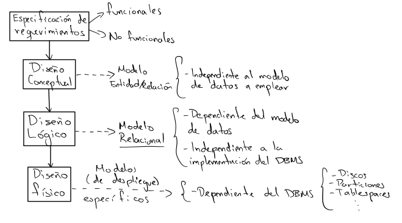
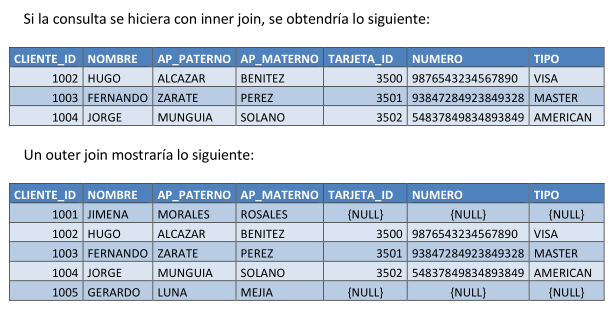

# Curso Laravel

[TOC]

Problamente esta es la sección del curso con mayor *complejidad*, dicha complejidad no reside en el uso de las herramientas para manipular los objetos de una base de datos sino en tener ciertos conocimientos de base de datos. De antemano si cuenta los conocimientos básicos de diseño de base de datos y SQL, puede saltarse la siguiente sección.

Laravel, así como muchos frameworks relacionados con el desarollo de sitios web utilizan un ORM para comunicarse con la base de datos, dicho ORM permite que la implementación del *modelo* (creación de entidades, constraints, llaves primarias, consulta y filtrado de datos y un largo etcétera) sea independiente del manejador de base de datos que estemos ocupando. A pesar de ello se deben tener los conocimientos mínimos del manejador que se vaya a ocupar para poder configurar la conexión y solucionar conflictos de una manera más diestra.

## Base de datos 

Empecemos intentanto sintetizar un curso completo de base de datos en algunas decenas de parráfos.

Una base de datos es ... [tarea]

Por otra parte un DBMS es ... [tarea]

Existen diversos tipos de base de datos ( y diversas formas de clasificar las BD), por ejemplo:  BD relacionales, BD XML, BD noSQL, etc.

Así mismo existen muchas formas de modelar los datos que en su mayoría corresponden con el tipo de base de datos en el que se vaya a implementar dicho modelo.

Los modelos más populares para representar datos son 

- El modelo entidad-relación (Diseño conceptual)
  - Para sus representación se utiliza el **formato Chen**
- El modelo relacional (Diseño lógico)
  - Para su representación se suele utilizar el **formato Crow's foot** o **formato IE** o **formato de Martin**
  - Una notación que también se suele utilizar es **IDE1X**.

Las bases de datos vistas en un esquema son:



Por suerte, a nosotros solo nos interesa **aprender el modelo relacional** poder pasarlo a modelos de *laravel*.


No veremos ejemplos tan complicados como el anterior, pero nos da una idea de lo que podremos enfrentarnos en un futuro.

### Modelo relacional

#### Entidades y atributos

**Las entidades** se representan por medio de **tablas**, las cuales son las unidades de almacenamiento primario. 

- Su nombre debe ser único. 
- El nombre de la entidad generalmente es un *sustantivo*.
- Se recomienda escribir su nombre en singular. 
- Los datos de una **columna** deber ser del mismo tipo. Cada columna representa un **atributo**  o **campo** de la entidad.
- Cada tabla debe contar con uno o más atributos para identificar de manera única a sus registros de manera única, llamada **llave primaria**.

Una **instancia** será equivalente a decir 1 **registro** de una tabla (**renglón**).

**Consideraciones**

- Una entidad deben contar con al menos 2 atributos
- Si un atributos se puede descomponer en sub atributos entonces este podría llevar a transformase en una entidad, depende de las *reglas de negocio*.

**Consideraciones muy particulares o poco frencuentes**

- Una entidad puede contar con un atributo, aunque no suele suceder.

<!-- Aquí van los ejemplos -->

##### Atributos obligatorios, opcionales y derivados

<!-- Falta completar aquí -->

#### Restricciones (Constraints)

El modelo relacional define las siguiente restricciones

| Tipo de restricciones           | Implementación          |
| ------------------------------- | ----------------------- |
| Restricciones de llave primaria | Primary key             |
| Restricciones de referencia     | Foreign key             |
| Restricciones de integridad     | Check, not null, unique |
| Validación por trigger          | Trigger                 |

*Únicamente las 2 primeras restricciones se ve de manera gráfica en el **diseño lógico**, las otras dos se implementan en el RDBMS.*

##### Restricciones de llave primaria

La llave primaria (PK) es una columna o conjunto de columnas cuyos valores identifican de manera única a cada registro de la tabla.

**Consideraciones obligatorias**

- Los valores de la PK no deben duplicarse
  - Para ello el RDBMS implementa n indice de tipo unique
- Los valores no pueden ser nulos
  - Para ello el RDBMS implementa una restricción *not null*
- Los valores de la PK no debe modificarse una vez asignados.
- Si una un registro de la tabla se borra su correspondiente valor no podrá volver a ser usado.

**Consideraciones opcionales**

- En cuanto a desempeño, una los valores de una PK deben ser *númericos, enteros y consecutivos*.

Existen varios tipos de llaves primarias, lo cierto es que en este curso solo utilizaremos llaves primarias artificiales por desempeño y por así viene configurado laravel

- **LLaves primarias artificiales**: Secuencia de valores enteros iniciando en 1 conocidos como id's de. Son atributos que no tienen significado para las reglas negocio.
- **Llaves primarias naturales**: Atributo que cuenta con las características para ser una PK y tiene signifcado para las reglas de negocio.
- **Llaves primarias cantidatas**: Atributo que cumple con la definición de PK pero que por algún motivo no fue seleccionada.
- **Llaves primarias compuestas**: Llave primaria formada por dos o más atributos
  - La unicidad de los valores depende de la combinación de los valores de cada atributo.

<!-- Ahora sí a poner ejemplos -->

##### Restricciones de referencia

Las restricciones de referencia se emplean para relacionar tablas, el RDBMS las representa por medio de llaves foráneas (FK).

Sean 2 entidades A y B en donde B puede ser igual a A.

*La FK es un atributo de una tabla B cuyos valors hacen referencia a los valores de la PK de una tabla A.*

Tipicamente a la tabla A se le conoce como tabla "PADRE" y a la  tabla B como "HIJA".

<!-- Ejemplos -->

#### Representación de relaciones

En todos los diseños de BD las entidades se relacionan entre ellas, de ahí el nombre de *modelo relacional*. Para identificar la manera en que se relacional se necesita conocer su tipo.

- Uno a uno **1:1** ó 1..1
- Uno a muchos **1:m** ó 1..*
- Muchos a muchos **m:n** ó * .. *

##### ¿Cómo detectar el tipo de relación?

Sean 2 entidades A y B, para cada una de ellas se deben analizar lo siguiente

**¿Cuántas instancias de A se relacionan con una de B?**

y la viceversa, **¿Cuántas instancias de B se relacionan con una de A?**

Las combinaciones de las respuestas pueden ser las siguientes


##### Ejemplos

<!-- Ver apuntes, tema 2 página 4 -->

##### Niveles de dependencia

Los niveles de dependencia indican que tan "fuerte" es la relación entre dos entidades.

###### Relaciones no identificativa

La relaciones no identificativas o suaves o débiles se emplean para representar principalmente relaciones 1:M aunque en algunos casos, se emeplean relaciones 1:1 y M:N.

- Se representan con una línea punteada.
- La PK de la tabla padre pasa como FK *únicamente*, en la tabla hija.

<!-- Ejemplos -->

###### Relaciones identificativa

Las relaciones identificativas o duras o fuertes se emplean para representar relaciones 1:1 principalmente.

- Se representan con una línea continua.
- La PK de la tabla padre pasará como PK y FK de la hija

##### Cardinalidad

La cardinalidad expresa el número mínimo y máximo de instancias asociadas con una instancia de otra entidad.

Se emplea el formato (x,y) en donde

- x = valor mínimo
- y = valor máximo (Si el valor no se conoce se escrbir ""*'' ).

Las posibles combinaciones se puede apreciar al observar la notación **crow's foot**. 


##### Relaciones unarias o recursivas

Las relaciones recursivas ocurren al relacionar *n* instancias de una entidad con una instancia de la misma entidad.

<!-- Ejemplos -->

##### Relaciones ternarias

En realidad son las relaciones muchos a muchos, lo único importante es que se emplea una tabla *intermedia* para poderse representar en el diseño lógico, dicha tabla intermedia puede

- Tener atributos, los cuales no forman parte de la entidad A ni de la entidad B sino de la relación.
- La tabla intermedia puede relacionarse con otras tablas a lo cual se le conoce como *agregación*.

#### Índices

Los indices de base de datos son similares a los índices de un libro, su objetivo es reparar un dato de la forma más rápida y eficiente posible.

Se suele indexar las columnas que se consulten de manera frecuente, por ejemplo: email, nombre, núm de cuenta, folio, etc.

¡Cuidado! a mayor número de índices puede existir problemas de desempeño en oparaciones DML (inserción, eliminación o actualización de datos).

### SQL

SQL Structured Query Language, actualmente Database Language Query, es un lenguaje de base de
datos empleado para:

- Creación y manipulación de las estructuras de una base de datos.
- Administración de los datos
- Ejecución de sentencias complejas diseñadas para transformar los datos almacenados en información útil.

#### Categorías de SQL

| Lenguaje                         | Definición                                                   | Clausulas básicas                                            |
| -------------------------------- | ------------------------------------------------------------ | ------------------------------------------------------------ |
| DDL (Data Definition Language)   | Lenguaje de definición de datos. Es el lenguaje encargado de la creación, modificación y eliminación de la estructura de los objetos de la base de datos (tablas, índices, vistas, etc) | create<br/>alter<br/>drop<br/>rename<br/>truncate<br/>comment |
| DML (Data Manipulation Language) | Lenguaje de manipulación de datos. Es el lenguaje que permite realizar las tareas de consulta, modificación y eliminación de los datos almacenados en una base de datos. | insert<br/>update<br/>delete<br/>merge                       |
| DCL (Data Control Languaje)      | Lenguaje de control de datos. Es el lenguaje encargado de configurar y establecer el control de acceso a la base de datos. Incluye instrucciones para definir accesos y privilegios a los distintos objetos de la base de datos. | grant<br/>revoke                                             |
| DQL (Data Query Language)        | Lenguaje de consulta de datos. Algunos autores clasifican a la instrucción SELECT como el único elemento de una cuarta categoría del lenguaje SQL Data Query Language (DQL). | select                                                       |
| Transaction control              | Control de transacciones. Es el lenguaje empleado para crear, y administrar transacciones aplicadas a un conjunto de sentencias DML principalmente. | commit<br/>rollback<br/>savepoint                            |

En este curso no aprenderemos SQL aunque si tendremos un ligero acercamiento al DQL ya que sin él no se podrían entender las instrucciones de laravel para recuperar la información de la base de datos. 

Saber DQL nos ayudará a realizar consultas de forma óptima y también nos ayudará entender los errores que el framework arroje.

#### Tipos de datos

#### DQL (Data Query Language)

La instrucción select es la única del DQL y sirve para obtener datos almacenados por el RDMS.

La sintaxis de la instrucción es sencilla, sin embargo, rara vez se emplea su forma simple.
Generalmente una consulta requiere hacer uso de condiciones, joins, agrupación de datos, etc.

##### Sintaxis SQL estándar

```sql
select [distinct]
{
    [<qualifier>.]<column-name>| * |<expression>
    | <pseudocolumn> as <column-alias>
    },...
from
{
	<table-or-view-name> | <inline-view> | [[as] <table-alias>]
}
[where <predicate>]
[group by [<qualifier>.]<column-name>,...
	[having <predicate>]
]
[order by {<column-name>|<column-number>}
	[asc|desc]
];
```

##### Ejemplos básicos

<!-- Aqui falta -->

##### Alias en columnas

Un alias de columna permite proporcionar una forma distinta de nombrar a una columna únicamente para ser presentada como parte de la respuesta de la instrucción SELECT.

##### Alias en tablas

De manera similar, los alias a nivel de tabla se emplean para nombrar o señalar a una tabla empleando
algún otro nombre.
Los alias de tablas se emplean principalmente para las sentencias select que requieren hacer uso de joins con otras tablas (se revisa más adelante este tema). En este caso normalmente las tablas se representan con unos cuantos caracteres para evitar escribir el nombre completo de la tabla.

##### Sub-consultas

<!-- falta -->

##### Operadores del álgebra relacional

El álgebra relacional es un lenguaje formal integrado principalmente por una serie de operadores unarios y binarios que se aplican sobre una o varias relaciones. 

El álgebra relacional define la manera desde un punto de vista teórico la forma de realizar la manipulación de los datos del contenido de una tabla

###### Union

La unión de 2 relaciones o conjuntos A y B es un nuevo conjunto que contiene todos los elementos de A y de B. En donde los duplicados se excluyen. 

Para realizar la unión, las columnas de ambas tablas deben ser compatibles en cuanto a número de columnas, y deben ser del mismo tipo de dato.


###### Interseccion

La intersección de 2 conjuntos A y B es el resultado de obtener todos los elementos comunes a A y B.


###### Diferencia

La diferencia de 2 conjuntos A y B se define como el conjunto A-B que consiste de todos los elementos
de A que no existen en B.

- $A-B \neq B - A$


###### Producto

El producto, o llamado también producto cartesiano formado por A X B de 2 conjuntos A y B, es un nuevo conjunto integrado por parejas de elementos {x,y}, donde x es un elemento de A, y y es un elemento de B.


##### Operador Join

El operador Join realiza una unión de 2 relaciones aplicando un predicado p para asociar las tuplas de R con las tuplas de S.

Para realizar la liga o asociación de tablas, siempre se realiza igualando los valores de los campos que tengan en común.

Los joins se pueden clasificar de la siguiente forma.

- Inner join
  - Equi join
  - No equi join
  - Natural join
- Outer join
  - Left outer join
  - Right outer join
- Cross join: Es equivalente al producto del álgebra relacional.
- Self join: Como su nombre lo indica, es un join consigo mismo, se presenta en relaciones recursivas.

Para efectos del curso solo nos concentraremos en los siguiente joins.

- Equi join al cual simplemente nos referiremos a él como inner join o cómo join
- Left outer join al cual haremos referencia como left join
- Right outer join al cual haremos referencia como right join

La principal diferencia de los Inner joins con los outer joins es que los inner joins únicamente incluyen en la salida de la consulta los registros que tengan correspondencia con la tabla asociada.

En el caso de un outer join es posible mostrar los registros faltantes, aunque no tengan una correspondencia con la tabla asociada. 

Por ejemplo, suponga que se desea mostrar el reporte de todos los clientes, aunque estos no cuenten con una tarjeta de crédito.



##### Inner join

##### Outer join

Las sentencias `left` y `right` reflejan el orden en el cual las tablas son procesadas por el manejador.
La primera tabla es la que se especifica en la cláusula from corresponde con el “lado izquierdo”, y la segunda tabla corresponde al “lado derecho”.

El siguinete caso puede aclarar las diferencias.

Un estudiante puede o no tener una beca, y una beca puede o no estar asociada a un estudiante, es decir, puede haber becas vacantes. Observar los datos de estas 2 tablas.


*Left outer join:*

Mostrar todos los estudiantes y si tiene beca, mostrar los datos de la beca.


```sql
select *
from estudiante e
left outer join beca b
on e.beca_id=b.beca_id;
```

*Right outer join:*
Mostrar todas las becas disponibles, y en caso de que esté asociada a un estudiante, mostrar sus datos:


```sql
select *
from estudiante e
right outer join beca b
on e.beca_id=b.beca_id;
```